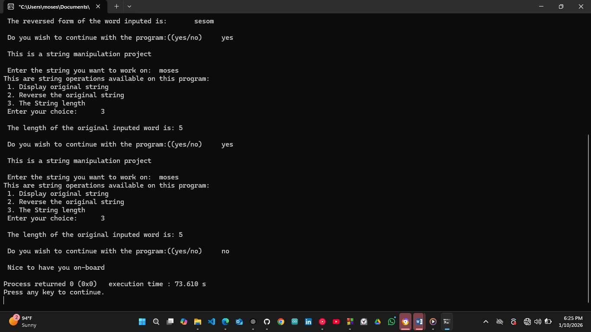

# String Operations Header – C Project

## Overview
This project is about learning how header files work in C programming. 
I used string manipulation to practice how to separate code into a main file, a header file, and a source file. 
The main goal is to make the code clean and reusable.

## Project Description
This is a simple string manipulation program written in C.
 - The user enters a string.
 - A menu is shown with different string operations.
 - The main file controls the program flow and user input.
 - The header file contains the function declarations.
 - The source file contains the logic for the string operations.

- The program can display the original string, reverse the string, or count the length of the string. After each operation, the user can decide to continue or stop the program.

## Project Structure
- main.c → handles user input, menu, and program loop [CLICK HERE FOR THE LINK](Source_Code/main.c)
- string_ops.h → contains function declarations and macros [CLICK HERE FOR THE LINK](Header_File/string_ops.h)
- string_ops.c → contains the string operation logic [CLICK  HERE FOR THE LINK](Source_Code/string_ops.c)

## Why Header Files
I used header files so the string functions can be reused in other projects. The functions are declared in the header file and defined in the source file. Include guards (#ifndef, #define, #endif) are used to stop multiple inclusion problems.

- This project helped me understand how files are connected in C.

## How the Code Works
- The program starts from the main() function.
- Standard libraries and the custom header file are included.
- The user enters a string.
- A menu of string options is displayed.
- The user selects an option.
- Main calls the correct function from the source file.
- The function performs the operation and prints the result.
- The program asks if the user wants to continue.
- If yes, the program repeats. If no, the program ends.

## What I Learned
- How header files work in C
- How to split code into multiple files
- How to work with strings in C
- How to reverse a string
- How to count string length
- How to write reusable code

## Images / Demo Video

[Click Here for the Demonstration Video](videos/String_Operations_Header_project_on_10th_December_2025.mp4)

## Embedded Systems Connection
In embedded systems, string handling is useful for LCD messages, serial communication, and menu systems. These string functions can be reused in projects where text needs to be displayed or processed, such as control panels or embedded user interfaces.
